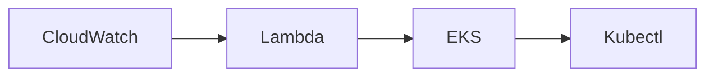

Lambda: EKS Event CloudWatch
----------------------------

A Lambda for forwarding CloudWatch Alarms to EKS Events.



## Requirements

### AWS IAM Permissions

```
{
    "Statement": [
        {
            "Action": "cloudwatch:ListTagsForResource",
            "Effect": "Allow",
            "Resource": "*"
        },
        {
            "Action": "eks:DescribeCluster",
            "Effect": "Allow",
            "Resource": "arn:aws:eks:REGION:ACCOUNT_ID:cluster/CLUSTER_NAME"
        }
    ],
    "Version": "2012-10-17"
}
```

### Kubernetes RBAC

```
apiVersion: rbac.authorization.k8s.io/v1
kind: ClusterRole
metadata:
  name: NAME
rules:
- apiGroups:
  - ""
  resources:
  - events
  verbs:
  - create
```

### CloudWatch Alarm Tags

```
skpr.io/k8s-event-api-version
skpr.io/k8s-event-kind
skpr.io/k8s-event-cluster
skpr.io/k8s-event-namespace
skpr.io/k8s-event-name
```
